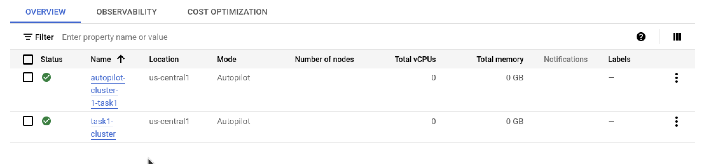
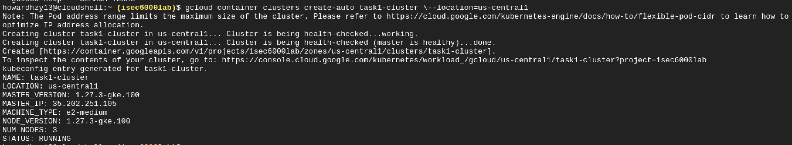
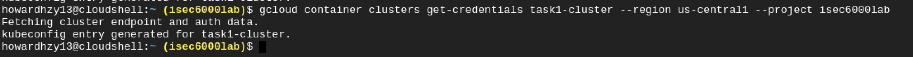

# ISEC6000_assessment1 
# Task1: Set Up Initial Infrastructure

## 1. Create a Kubernetes Cluster on GKE (or equivalent tool)

## 2. Install and configure kubectl to manage your Kubernetes cluster

